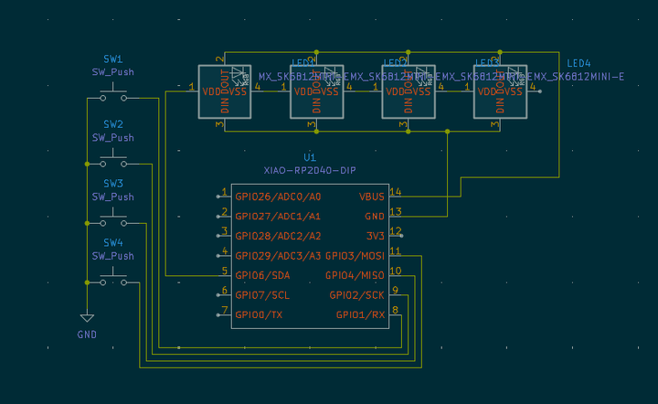
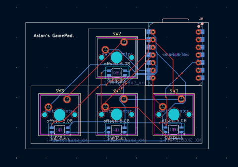

# **AslanPad**
## **Introduction**

This is a little macropad I made, It consists of a Xiao RP2040, 8  Cherry MX Switches and 8 RGB LEDs, Its basically a little rgb keyboard that consits of eight keys that i've coded to be 1-8 thou that can be changed from the code, The 8 Backlight RGB LEDs circle through the color wheel in a smooth animation and to give a sense of feedback each key is assigned a color that shows up when that key is pressed. Thats it :).

---

## **Required Parts**

1x Seeed XIAO RP2040 DIP,
8x Cherry MX-Style switches (Green preferably),
8x Blank DSA Keycaps,
8x SK6812 MINI-E LEDs,
4x M3x16mm screws,
1x 3D printed case (consists of two parts),
1x Soldering Iron/Kit,
1x PCB.

---

## **Images**

### **Render**

### **Schematic**

### **PCB**

